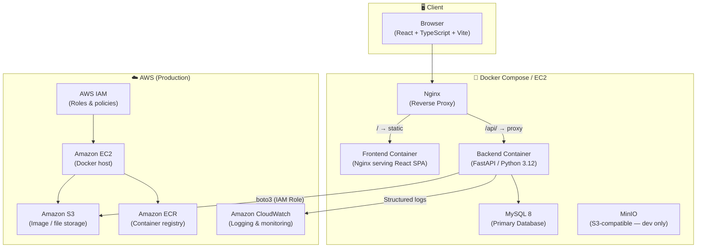
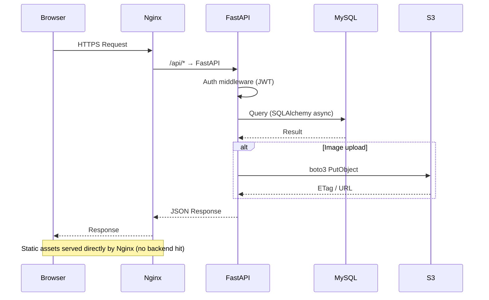
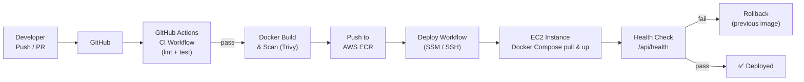
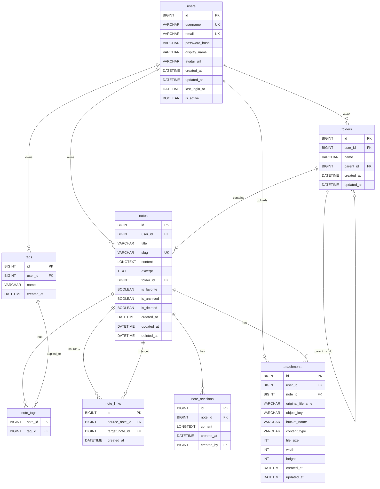
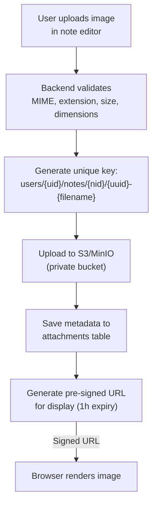
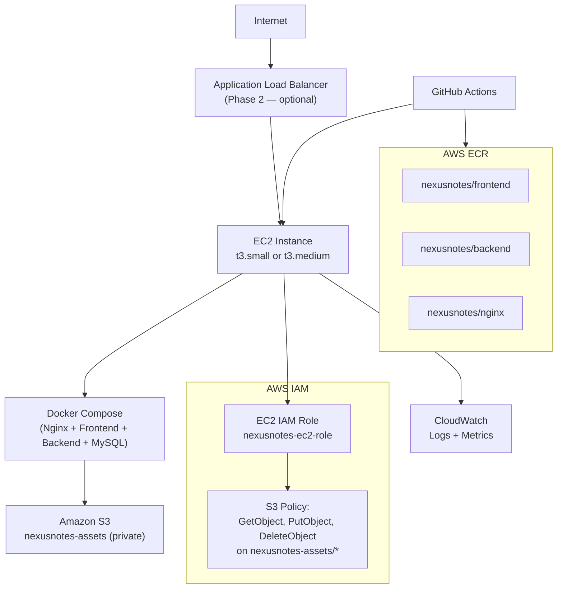
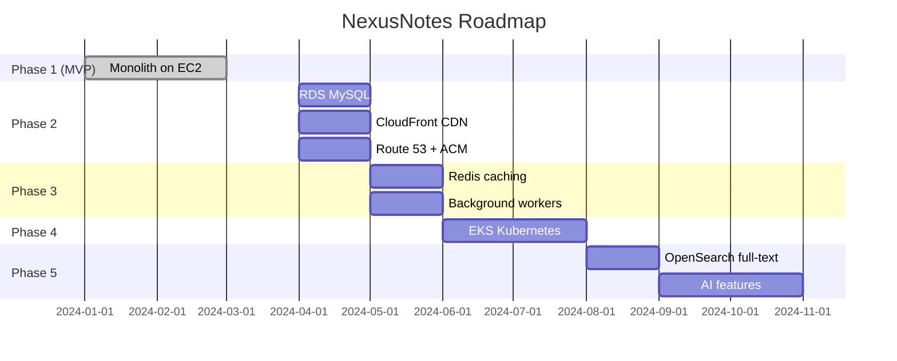

# NexusNotes — Project Architecture

## Overview

NexusNotes is a cloud-native, full-stack knowledge-management platform designed
as a modern, open-source alternative inspired by the concepts of Obsidian and Notion.

The application is independently implemented. No proprietary source code, assets,
or branding from any commercial application has been used.

---

## High-Level Architecture



---

## Application Request Flow



---

## CI/CD Pipeline



---

## Detailed Component Architecture

### Frontend

```
frontend/src/
├── components/
│   ├── ui/           ← shadcn/ui primitives (Button, Dialog, etc.)
│   ├── layout/       ← AppShell, Sidebar, TopBar, ContextPanel
│   ├── editor/       ← CodeMirror 6 Markdown editor + toolbar
│   ├── graph/        ← D3.js force-directed knowledge graph
│   ├── search/       ← Search bar + Command palette (Ctrl+K)
│   ├── attachments/  ← Fabric.js image editor + upload
│   └── notes/        ← NoteList, NoteCard, BacklinkPanel
├── hooks/            ← useNotes, useAuth, useSearch, useGraph…
├── stores/           ← Zustand (auth, ui, editor, sidebar)
├── services/         ← API client (Axios + TanStack Query)
├── pages/            ← Login, Register, Dashboard, Graph, Settings
├── lib/              ← utils, zod schemas, constants
└── types/            ← TypeScript interfaces and types
```

**State Management Strategy:**

| State Type | Tool |
|---|---|
| Global auth state | Zustand |
| UI state (sidebar, theme) | Zustand |
| Server state (notes, folders) | TanStack Query |
| Form state | React Hook Form + Zod |
| Editor state | CodeMirror state |

---

### Backend

```
backend/app/
├── api/v1/
│   ├── auth.py        ← POST /register, /login, /logout, GET /me
│   ├── notes.py       ← Full CRUD, revisions, backlinks, related
│   ├── folders.py     ← Folder tree CRUD
│   ├── tags.py        ← Tag CRUD
│   ├── attachments.py ← Upload, download (presigned), edit, delete
│   ├── search.py      ← Full-text search endpoint
│   ├── graph.py       ← Graph nodes + edges for D3
│   └── health.py      ← /health + /ready
├── core/
│   ├── config.py      ← Pydantic BaseSettings (typed config)
│   ├── security.py    ← JWT encode/decode, password hashing
│   ├── logging.py     ← Structured JSON logging
│   └── middleware.py  ← Request ID, timing, error handling
├── db/
│   ├── base.py        ← SQLAlchemy DeclarativeBase
│   └── session.py     ← Async engine, session factory, Depends()
├── models/            ← ORM models (8 tables)
├── schemas/           ← Pydantic request/response schemas
├── repositories/      ← DB access layer (no business logic)
├── services/          ← Business logic (wiki-link parsing, S3, etc.)
├── dependencies/      ← FastAPI Depends() — auth, pagination, etc.
└── main.py            ← App factory with lifespan
```

**Layer Responsibility:**

```
Route Handler → Schema validation → Service → Repository → DB
                     ↓
              Return Schema → JSON Response
```

---

## Database Architecture



---

## S3 Storage Architecture



**Object Key Format:**
```
users/{user_id}/notes/{note_id}/{uuid4}-{sanitized_filename}
```

**Example:**
```
users/42/notes/17/3f8a2b1c-d4e5-...-my-diagram.png
```

---

## Security Architecture

```mermaid
flowchart TD
    subgraph Authentication
        Login["POST /api/auth/login"] --> JWT["Generate JWT\n(HS256, 60min expiry)"]
        JWT --> Cookie["httpOnly Cookie\n(refresh token)"]
        JWT --> Header["Authorization: Bearer\n(access token)"]
    end

    subgraph Authorization
        Req["Authenticated Request"] --> Middleware["JWT Middleware\nVerify + Decode"]
        Middleware --> Dep["get_current_user\nDependency"]
        Dep --> Check["User owns resource?\n(user_id check)"]
    end

    subgraph InputValidation
        API["API Endpoint"] --> Pydantic["Pydantic Schema\nValidation"]
        Pydantic --> Service["Service Layer\nBusiness Rules"]
    end

    subgraph FileUpload
        File["Uploaded File"] --> MimeCheck["MIME Type Check\n(whitelist)"]
        MimeCheck --> ExtCheck["Extension Check\n(whitelist)"]
        ExtCheck --> SizeCheck["Size Check\n(≤ 10MB)"]
        SizeCheck --> DimCheck["Dimension Check"]
        DimCheck --> S3Upload["Upload to S3"]
    end
```



---

## AWS Architecture (Production)



---

## Technology Stack Summary

| Category | Technology | Version |
|---|---|---|
| Frontend | React | 18 |
| Frontend | TypeScript | 5 |
| Frontend | Vite | 5 |
| Frontend | Tailwind CSS | 3 |
| Frontend | shadcn/ui | latest |
| Frontend | TanStack Query | 5 |
| Frontend | Zustand | 4 |
| Frontend | React Hook Form | 7 |
| Frontend | Zod | 3 |
| Frontend | CodeMirror | 6 |
| Frontend | D3.js | 7 |
| Frontend | Fabric.js | 5 |
| Backend | Python | 3.12 |
| Backend | FastAPI | 0.110+ |
| Backend | SQLAlchemy | 2 |
| Backend | Pydantic | 2 |
| Backend | Alembic | 1.13+ |
| Backend | python-jose | 3 |
| Backend | passlib (bcrypt) | 1.7+ |
| Backend | boto3 | 1.34+ |
| Database | MySQL | 8.0 |
| Proxy | Nginx | 1.25 |
| Container | Docker | 24+ |
| CI/CD | GitHub Actions | — |
| Registry | AWS ECR | — |
| Compute | AWS EC2 | — |
| Storage | AWS S3 | — |

---

## Future Architecture Phases


