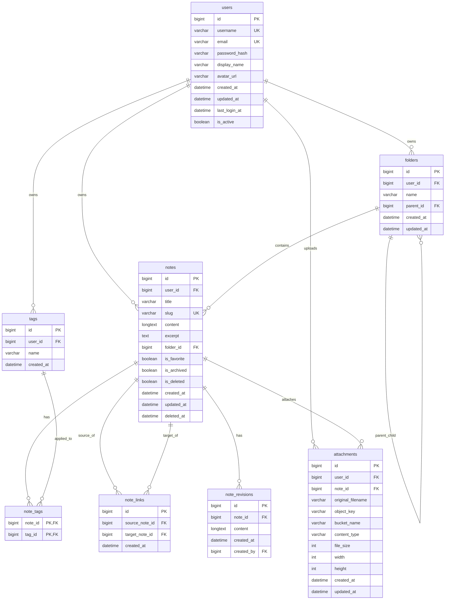

# Database Architecture & Schema — NexusNotes

## Database Engine
- **Engine**: MySQL 8.0 (InnoDB)
- **Character Set**: `utf8mb4`
- **Collation**: `utf8mb4_unicode_ci`

---

## Entity Relationship Diagram



---

## Indexing Strategy

1. `notes (user_id, slug)`: Unique compound index for rapid URL slug resolution per user.
2. `notes (is_deleted, is_archived, is_favorite)`: Fast filtering for sidebar views (All Notes, Trash, Favorites).
3. `FULLTEXT (title, content)`: MySQL full-text search indexing with boolean mode matching.
4. `note_links (source_note_id, target_note_id)`: Bidirectional index providing $O(1)$ query performance for backlink calculation and knowledge graph queries.
5. `attachments (object_key)`: Unique identifier index for fast S3 object key lookups.

---

## Database Migrations

Migrations are managed with **Alembic**:
```bash
# Generate a new migration revision based on model changes
make migrate-create MSG="add_note_revisions"

# Apply pending migrations to database
make migrate

# Roll back the most recent migration
make migrate-down
```
